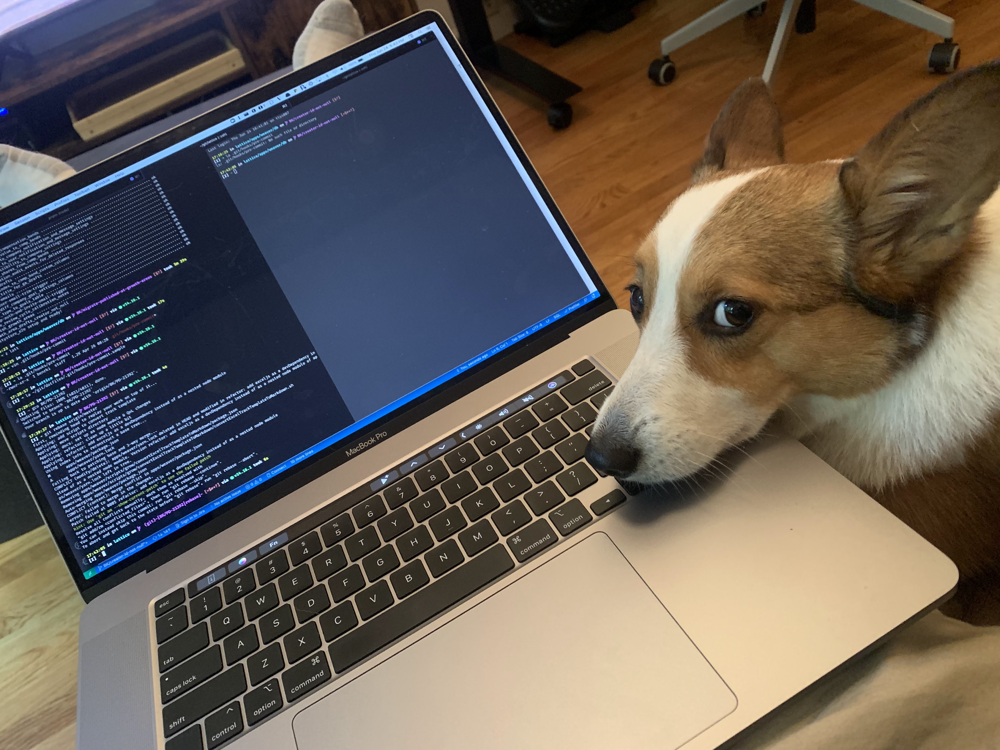
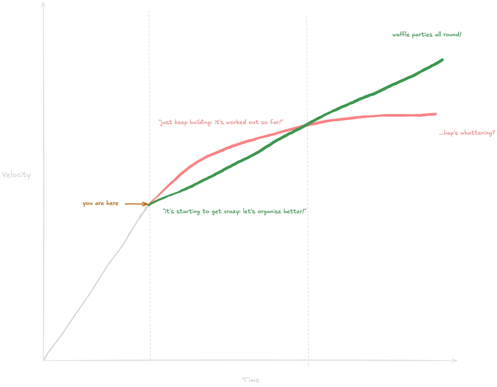

autoscale: true
build-lists: true
code-language: python
theme: Space, 4

# pkg_arch

---

## 3928

^ number guessing game

---

## python files in common/lumos

^ number of python files in lumos/backend/python/common
^ find lumos -name "*.py" -type f | wc -l

---

## 3124 results in 575 files

---

# direct references to the User model

^ bonus: there are 549 SQLAlchemy models
^ find backend/python/common/lumos/models/ -name "*.py" ! -name "__init__.py" ! -name "*test.py" -type f | wc -l

---

## 8.89

---

## Average imports per file

- 60 imports `backend/python/common/lumos/controllers/flows_v2/steps/core/custom_capability_step.py`:
- 64 imports `backend/python/common/lumos/controllers/flows/actions/access_request/provision_access_action.py`
- 96 imports `backend/python/common/lumos/controllers/flows_v2/handler.py`
- 119 imports `backend/python/common/lumos/controllers/auth/factory.py`
- 266 imports `backend/python/common/lumos/models/__init__.py`

^ don't take this too seriously, more of a barometer of overall codebase compaction
^ irony: 3/5 are flows

---

^ let's talk about tapas
^ spain
^ DYK: the most  sagrada familia

---

^ construction began in 1882.
^ Designed by Antoni Gaudí, who died in 1926—only about 15% was complete.
^ over a dozen architects over 143 years
^ There were no detailed blueprints, just sketches and abstract models—many of which were destroyed in a fire during the Spanish Civil War.

---

## Conway’s Law

### `Software == Org`

^ software mirrors the organisation
^ this guy is now a twitter activist but don't read into it

---

### modular pods need modular software

^ we rely heavily on communication across pods through both humans but also through the codebase through software design and patterns

---

### coupled code is (usually) bad code

^ Coupled code is really hard to understand and change because it’s specific

---

### we ship super fast

^ finally, lumos has the healthiest "bias to action" culture i've ever seen
^ this might be the fastest company i've ever worked at
^ and this is startup #7 for me

---

## why do anything?

^ the approach we've taken so far is working pretty well
^ we have been shipping many successful projects
^ the pre-IDP projects have shipped faster than any startup i've ever been at before

---

---

## Tofu’s Theory of Startup Development Velocity

^ old colleague of mine

---

^ somewhere around Series B->C things start to slow down exponentially
^ that's ok, inevitable even
^ SOC2, GDPR, HIPPA
^ codebase complexity
^ customer contract SLAs, support, CSEs
^ scaling/performance considerations
^ tech debt
^ size of teams and org structure
^ how hard you hit that wall depends on
^ 1. how good your people are
^ 2. how well you prepare

---

## opinions (on our tech)

---

### it's tightly coupled

- GQL resolvers know how to use SQLAlchemy
- `graphene_sqlalchemy` exists :(
- Controllers know about `lumos_db`
- Domain models are shared everywhere

---

### we write code inconsistently

especially across pods (sometimes within the same pod)

- naming conventions
- design patterns
- code organisation and boundaries
- types
- OOP x FP hybrid

---

### Lumos engineers are really clever, really fast

---

## lumos.defrag()

^ defragmentation analogy
^ let's not stop the world with sweeping, broad refactors
^ but we can do much better by starting to make some appropriate adjustments
^ reasonable investment into better patterns, starting with code consolidation!
^ what makes sense?

<!---

### Tofu’s (Example) Software Maturity Spectrum

^ case study provided by my colleague

- style guide
- layer decoupling <- you are here
- testing pyramid
- package framework
- dependency injection
- pod-based code organisation
- Service-Oriented Architecture
- Event Driven Architecture

--->

---

### package architecture

smaller components
based on a domain model and the most relevant dependencies (use reasonable judgment!)
easier to reason about
encapsulation, isolation
consolidates APIs
faster tests, CI, DX

^ mypy is significantly faster
^ tests are significantly faster
^ the goal is to be able to define a boundary where running tests on transitive dependencies is no longer necessary

---

## example

^ demo that shit

---

### could we just use ai?

ai does what humans do

diminishing returns with increased complexity

in general, ai is less accurate when the context is too large

same as a human: how do you filter through large amounts of data all in context at the same time?

packages help us narrow the problems being solved into easily conceivable chunks

tl;dr we can use ai to accomplish this, but today ai alone cannot substitute for good software architecture

---

<!---

### next up

- [python style guide](https://www.notion.so/lumosapp/Python-Style-Guide-1cc3b0ad640280ccb3a0e3385152447e?pvs=4)
- composition and inheritance
- dependency injection + integration tests: your new best friends
- Tofu's Spectrum of Software Maturity

--->

^ when Gaudi started on the sagrada familia, the main architecture instruments were paper, rulers and physical models made of plaster, cardboard and wood
^ The construction now relies on modern tech (e.g., CNC machines, computer modeling) alongside traditional methods.
^ Gaudi himself said he would never see it completed in his lifetime
^ after 43 years, he was proven right
^ today, the latest estimate is that construction will finally complete in 2026. exactly 100 years after gaudi passed.
^ we won't have 143 years, but we can make something fantastic in much shorter than that
